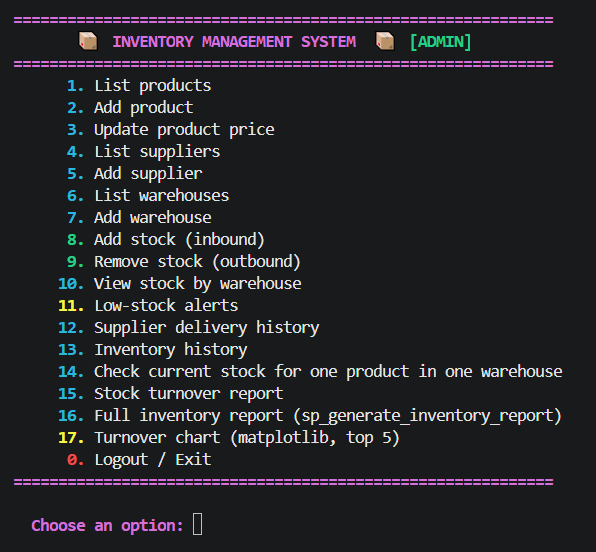
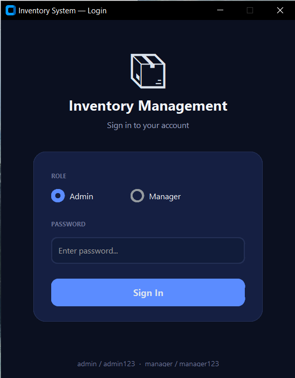
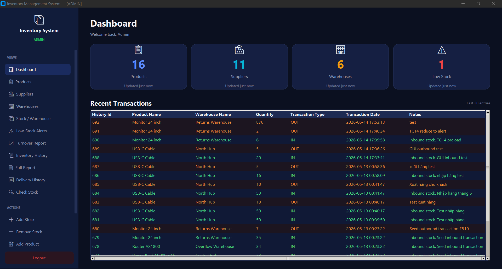
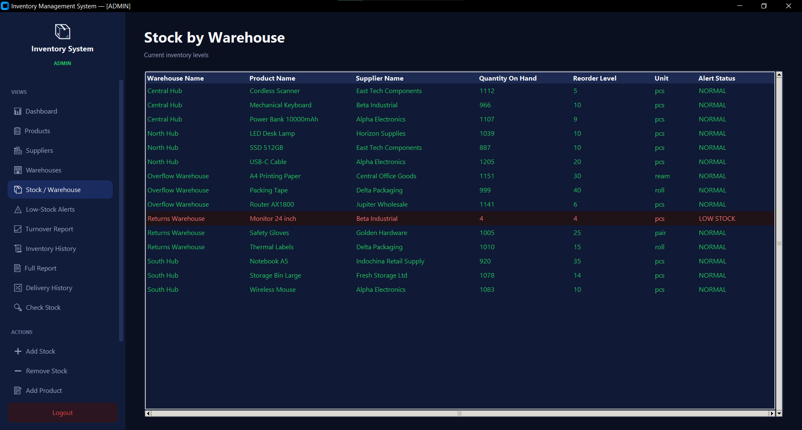
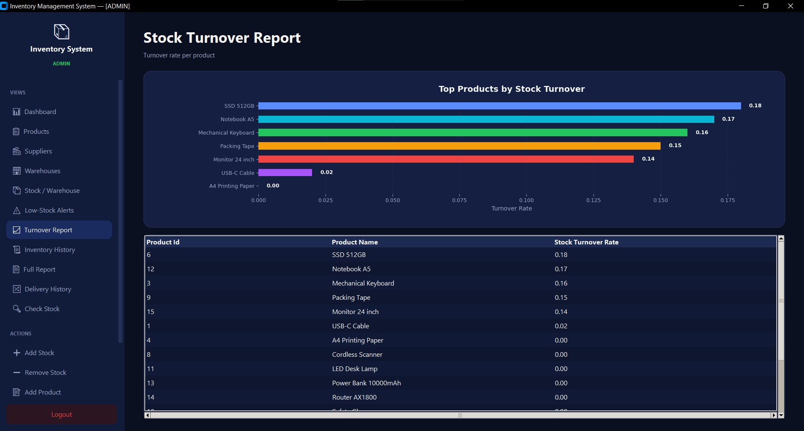

<p align="center">
  
</p>

<h1 align="center">📦 Inventory Management System</h1>

<p align="center">
  <strong>A full-stack inventory system built with MySQL &amp; Python</strong><br/>
  Final Project — Database Management Course · NEU College of Technology
</p>

<p align="center">
  
  
  
  
</p>

---

## 📸 Screenshots

<table>
  <tr>
    <td></td>
    <td></td>
  </tr>
  <tr>
    <td align="center"><em>Login Screen</em></td>
    <td align="center"><em>Dashboard</em></td>
  </tr>
  <tr>
    <td></td>
    <td></td>
  </tr>
  <tr>
    <td align="center"><em>Stock by Warehouse</em></td>
    <td align="center"><em>Turnover Chart</em></td>
  </tr>
</table>

> Replace the placeholder images with actual screenshots from your app.

---

## ✨ Features

### Database (MySQL)
- 6 normalized tables with PKs, FKs, and CHECK constraints
- 510+ auto-generated sample records
- 8 performance indexes
- 3 views — stock summary, low-stock alerts, delivery history
- 2 user-defined functions — current stock, stock turnover
- 3 triggers — auto-update inventory on stock changes
- 5 stored procedures — add/remove stock, restock, reports, seeding
- Role-based security (admin + inventory manager)

### Python CLI (`main.py`)
- 17 menu options with colorama color-coded output
- Role-based login (Admin / Manager)
- Matplotlib bar chart export (PNG)
- Environment-based config via `.env`

### Python GUI (`gui.py`)
- Modern dark theme built with CustomTkinter
- Dashboard with 4 KPI cards + recent transactions
- 11 data views + 6 action forms = 17 features
- Scrollable sidebar with active page highlighting
- Color-coded tables (LOW STOCK = red, IN = green, OUT = orange)
- Embedded turnover chart via matplotlib
- Role-based access with locked features for Manager

---

## 📂 Project Structure

```
inventory_final_project/
│
├── assets/
│   └── original_assignment.pdf          ← Original project assignment PDF
│
├── docs/
│   ├── screenshots/
│   │   ├── gui_chart.png                ← GUI turnover report screenshot
│   │   ├── gui_dashboard.png            ← GUI dashboard screenshot
│   │   ├── gui_login.png                ← GUI login screenshot
│   │   └── gui_stock.png                ← GUI stock/warehouse screenshot
│   │
│   ├── cli_preview.png                  ← CLI application screenshot
│   ├── ERDiagram of Inventory Management System.png
│   │                                     ← ER diagram image
│   ├── inventory_erd.mmd                ← ERD source (Mermaid)
│   ├── Relational Schema Diagram of the Inventory Management System.png
│   │                                     ← Relational schema diagram
│   └── relational_schema.md             ← Relational schema documentation
│
├── python_app/
│   ├── __pycache__/                     
│   ├── .env.example                     ← Environment variable template
│   ├── db.py                            ← MySQL connection helper
│   ├── GUI.py                           ← GUI application (CustomTkinter)
│   ├── main.py                          ← CLI application
│   ├── requirements.txt                 ← Python dependencies
│   └── services.py                      ← Business logic / DB queries
│
├── sql/
│   ├── 01_create_database_and_tables.sql
│   │                                     ← Create database and tables
│   ├── 01_full_project.sql              ← Run this file to set up the full project
│   ├── 02_indexes.sql                   ← Index definitions
│   ├── 03_functions_triggers_procedures.sql
│   │                                     ← Stored procedures, functions, triggers
│   ├── 04_views.sql                     ← SQL views
│   ├── 05_sample_data.sql               ← Sample data insertion
│   ├── 06_security_backup.sql           ← Security roles and backup notes
│   └── 07_demo_queries.sql              ← Demo/test queries
│
├── submission/
│   └── final_submission_report_....pdf  ← Final report PDF
│
└── README.md                            ← Project overview and usage guide
```

---

## 🚀 Quick Start

### Prerequisites

- MySQL 8.0+
- Python 3.10+

### 1. Set up the database

```sql
SOURCE sql/01_full_project.sql;
```

This creates the database, all tables, indexes, functions, triggers, procedures, views, and generates 510 sample records.

### 2. Configure Python

```bash
cd python_app
pip install -r requirements.txt
```

Create `.env` from template:

```bash
cp .env.example .env          # macOS / Linux
copy .env.example .env        # Windows
```

Edit `.env`:

```env
MYSQL_HOST=localhost
MYSQL_PORT=3306
MYSQL_USER=root
MYSQL_PASSWORD=your_password
MYSQL_DATABASE=personal_finance
```

### 3. Run

```bash
python main.py     # CLI version
python gui.py      # GUI version
```

### 4. Login

| Role | Username | Password | Access |
|------|----------|----------|--------|
| Admin | `admin` | `admin123` | Full access |
| Manager | `manager` | `manager123` | View + Add stock only |

---

## 🗃️ Database Design

<p align="center">
  
</p>

| Table | Purpose |
|-------|---------|
| `suppliers` | Supplier master data |
| `products` | Product catalog with reorder levels |
| `warehouses` | Warehouse locations and capacity |
| `warehouse_stock` | Current stock per product/warehouse |
| `stock_entries` | Inbound purchase records |
| `inventory_history` | Full IN/OUT transaction log |

| Object | Count | Examples |
|--------|-------|---------|
| Indexes | 8 | product name, supplier, warehouse, dates |
| Views | 3 | stock by warehouse, low stock, delivery history |
| Functions | 2 | `fn_current_stock()`, `fn_stock_turnover()` |
| Triggers | 3 | auto-update stock, validate outbound |
| Procedures | 5 | add/remove stock, restock, reports, seeding |

---

## 🖥️ All 17 Features

| # | Feature | Admin | Manager |
|---|---------|:-----:|:-------:|
| 1 | List products | ✅ | ✅ |
| 2 | Add product | ✅ | 🔒 |
| 3 | Update product price | ✅ | 🔒 |
| 4 | List suppliers | ✅ | ✅ |
| 5 | Add supplier | ✅ | 🔒 |
| 6 | List warehouses | ✅ | ✅ |
| 7 | Add warehouse | ✅ | 🔒 |
| 8 | Add stock (inbound) | ✅ | ✅ |
| 9 | Remove stock (outbound) | ✅ | 🔒 |
| 10 | View stock by warehouse | ✅ | ✅ |
| 11 | Low-stock alerts | ✅ | ✅ |
| 12 | Supplier delivery history | ✅ | ✅ |
| 13 | Inventory history | ✅ | ✅ |
| 14 | Check stock (1 product/warehouse) | ✅ | ✅ |
| 15 | Stock turnover report | ✅ | ✅ |
| 16 | Full inventory report | ✅ | ✅ |
| 17 | Turnover bar chart (matplotlib) | ✅ | ✅ |

---

## 📦 Tech Stack

| Layer | Technology |
|-------|-----------|
| Database | MySQL 8.0 |
| Backend | Python 3.13 |
| CLI | colorama |
| GUI | CustomTkinter |
| Charts | matplotlib |
| DB Connector | mysql-connector-python |
| Config | python-dotenv |

---

## 🎥 Demo

📺 **YouTube**: [Watch the demo](YOUR_YOUTUBE_LINK_HERE)

---


